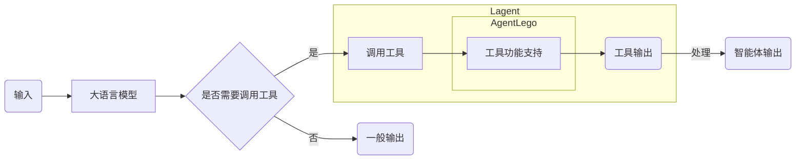

# Lecture 5 note & homework

# Note

大模型部署: 参数很冗余, 减少模型参数

## LMDeploy

```mermaid
flowchart LR
    subgraph Lagent
        tool[调用工具]
        subgraph AgentLego
            tool_support[工具功能支持]
        end
        tool_output(工具输出)
        tool --> tool_support --> tool_output
    end

    input(输入) --> LLM[大语言模型]
    LLM --> IF{是否需要调用工具}
    IF -->|否| output(一般输出)
    IF -->|是| tool
    tool_output -->|处理| agent_output(智能体输出)
```

# Homework

天气的例子, 试了下挺快的. 

第二部分的

检测物体上, 这种检测不出来. 

示例图倒是检测的不错. 
